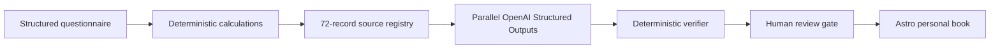

# Omyear

**A source-linked personal year book, built with Codex and the OpenAI Responses API.**

Omyear turns a structured birthday questionnaire into a warm, responsive book for
the year from one birthday to the next. Deterministic code performs the calculations;
OpenAI models write only from registered sources; a verifier checks every citation and
required section; a human keeps the final editorial decision.

This is the sanitized OpenAI Build Week 2026 submission repository. It contains one
fully synthetic person, Maya, and no customer photos, private recipient books, music,
or production data.

## Try it

After starting the site locally:

- `/` — short product introduction;
- `/try` — bilingual consent-first questionnaire and live generation;
- `/result?demo=maya` — the private-result renderer populated with synthetic data;
- `/pipeline` — the seven-stage algorithm and current verification snapshot;
- `/0811` — Maya’s generated book, including its expandable source ledger.

Maya is public and passwordless. All names, biography, goals and locations in her
questionnaire are invented for the demo.

Deployed demo: [app.omyear.com](https://app.omyear.com) · Public source:
[github.com/valery-om/omyear](https://github.com/valery-om/omyear)

## The sequence



Each run keeps:

```text
input.json → calc.json → prompt.txt → draft.json → verification.json
           → model-response.json → book.json → run-report.json
```

The terminal state is intentionally `needs_human_review`. A successful model call is
never treated as permission to publish a personal reading.

## What the OpenAI model does—and does not do

The model has one bounded role: transform the supplied source registry into editorial
JSON conforming to [`draft.schema.json`](pipeline/schemas/draft.schema.json). Every
interpretive object must include exact `sourceIds`, a confidence value and a review
flag.

The model does **not** calculate charts, invent biography, approve its own output, or
deploy a book. `calculate.py`, `verify.mjs` and the human review boundary own those
responsibilities.

The included public demo was produced by the Responses API with resolved model
`gpt-5.6-sol`. Sanitized metadata is in
[`evidence/gpt-5.6-run.json`](evidence/gpt-5.6-run.json), and the response ID is also
visible in Maya’s in-product provenance section.

The public creation flow uses three parallel `gpt-5.6-terra` Structured Output calls
for portrait, year and practice chapters. Code then merges the segments, restores all
deterministic fields and verifies the complete draft. The pre-generated evidence demo
remains the original single-pass `gpt-5.6-sol` run.

## How Codex contributed

Codex collaborated on the core Build Week extension:

- audited the pre-existing handcrafted Omyear project and separated new work;
- designed the strict input and editorial schemas;
- generalized the deterministic calculation engine;
- implemented the Responses API adapter, source registry, verifier and compiler;
- created the synthetic demo and visible provenance ledger;
- built and tested the bilingual questionnaire, streamed progress and private result renderer;
- tested desktop/mobile behavior and added self-contained E2E coverage;
- prepared the sanitized public repository and submission documentation.

The product owner made the key product and editorial decisions: calculations stay
deterministic, model prose stays source-bounded, symbolic frameworks are presented as
reflection rather than prediction, the public demo uses synthetic data, and a person
always approves the final book.

## Build Week delta

Omyear’s visual language and several handcrafted private books existed before the
submission period. The work evaluated here is the repeatable engine added after July
13: schemas, generalized calculations, OpenAI generation, deterministic verification,
book compilation, bilingual creation flow, protected API gateway, synthetic public
demo, provenance UI, tests and documentation.

See [`docs/BUILD_WEEK_CHANGELOG.md`](docs/BUILD_WEEK_CHANGELOG.md) for the explicit
before/after boundary.

## Local setup

Prerequisites: Node.js 20.19+ (or 22.12+), Python 3.11+, and `pyswisseph`.

```bash
python3 -m pip install pyswisseph
npm --prefix web install
npm run check
npm run dev
```

Open [http://localhost:4321](http://localhost:4321).

### Rehearse without an API call

```bash
node pipeline/run.mjs --input pipeline/examples/maya.json --provider fixture
```

The fixture exercises the complete orchestration but is explicitly labelled
`fixture`; it is not evidence of GPT‑5.6 usage.

### Run GPT‑5.6

```bash
cp .env.example .env.local
# Add an OpenAI Platform API key to .env.local, then:
node --env-file=.env.local pipeline/run.mjs \
  --input pipeline/examples/maya.json \
  --provider openai --model gpt-5.6-sol
```

`.env.local` and all `pipeline/runs/` directories are ignored by Git.

## Submission gallery

- [`01-product-home.png`](docs/screenshots/01-product-home.png) — product promise;
- [`02-pipeline.png`](docs/screenshots/02-pipeline.png) — sequential algorithm;
- [`03-maya-demo.png`](docs/screenshots/03-maya-demo.png) — synthetic generated book.

## Verification snapshot

The included GPT‑5.6 demo currently has 72 known records, 53 distinct sources cited,
zero invalid source IDs, missing citations, structural errors or language warnings,
and one correctly surfaced human-review flag for a three-framework synthesis.

Production RU and EN questionnaire runs also completed in under 30 seconds each with
zero source-link errors. Sanitized browser-QA counts are recorded in
[`evidence/live-bilingual-runs.json`](evidence/live-bilingual-runs.json).

```bash
npm run test
npm run build
npm run audit
```

## Safety and privacy

All included systems are presented as symbolic self-reflection frameworks, not
scientific findings or event predictions. Omyear does not provide medical, legal,
mental-health, credit or investment advice.

Real questionnaires and run artifacts can contain sensitive personal data. They do
not belong in this repository. See [`SECURITY.md`](SECURITY.md) and
[`docs/TESTING.md`](docs/TESTING.md). Static hosting instructions are in
[`docs/DEPLOYMENT.md`](docs/DEPLOYMENT.md).

## License

MIT. See [`LICENSE`](LICENSE).
